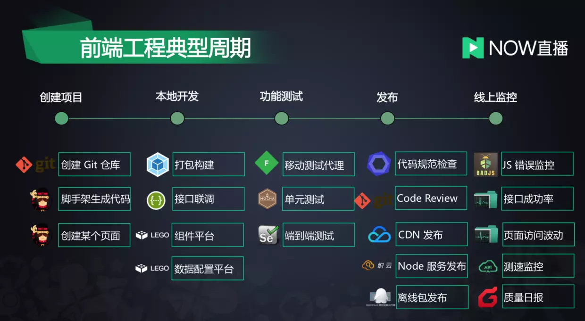

#  Webpack 工程化

- [配置参考](https://www.webpackjs.com/configuration/)
- [中文文档](https://www.webpackjs.com/concepts/)
- [2019年一半已过，这些大前端技术你都GET了吗？- 下篇](https://juejin.im/post/5d47cbb06fb9a06af6299430)
- [模块化](https://baike.baidu.com/item/模块化/3295536)

---

- 什么是模块化开发？
- 为什么是 Webpack？
- Webpack 中的配置有哪些，分别可以帮我们解决什么问题？
- Webpack 中的概念有哪些？
- 这些概念在 Webpack 内核实现和原理上是怎么实现的？
- 除了打包，我们还可以使用 Webpack 做什么？

### 工程化

> 涵盖项目创建、开发、编译、打包测试、发布、监控等流程

> Grunt、Gulp 这类构建工具，打包的思路是：`遍历源文件→匹配规则→打包`，这个过程中做不到按需加载

> webpack 是从入口文件开始，经过模块依赖加载、分析和打包三个流程完成项目的构建

> 在加载、分析和打包的三个过程中，可以针对性的做一些解决方案，比如code split（拆分公共代码等）

**Webpack 可以轻松的解决传统构建工具解决的问题**

- 模块化打包，一切皆模块，JS 是模块，CSS 等也是模块；
- 语法糖转换：比如 ES6 转 ES5、TypeScript；
- 预处理器编译：比如 Less、Sass 等；
- 项目优化：比如压缩、CDN；
- 解决方案封装：通过强大的 Loader 和插件机制，可以完成解决方案的封装，比如 PWA；
- 流程对接：比如测试流程、语法检测等。

---

### 模块化

> 模块化是指解决一个复杂问题时自顶向下逐层把系统划分成若干模块的过程，有多种属性，分别反映其内部特性。（百度百科）

> 模块化的规范：CommonJS、AMD和ES6 Module规范（另外还有CMD、UMD等）

- CommonJS：是 Nodejs 广泛使用的一套模块化规范，是一种同步加载模块依赖的方式
- AMD：是 js 模块加载库RequireJS提出并且完善的一套模块化规范，AMD 是一条异步加载模块依赖的方式
- ES6 Module：ES6 推出的一套模块化规范

---

- 模块化一般指的是可以被抽象封装的最小/最优代码集合，模块化解决的是功能耦合问题
- 组件化则更像是模块化进一步封装，根据业务特点或者不同的场景封装出具有一定功能特性的独立整体
- 前端提到组件化更多的是具有模板、样式和 js 交互的 UI 组件

